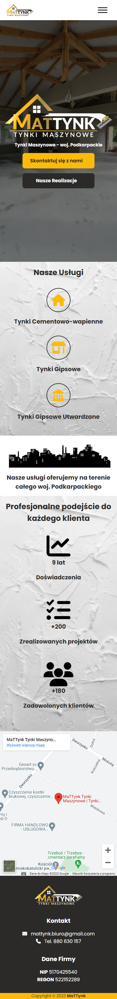
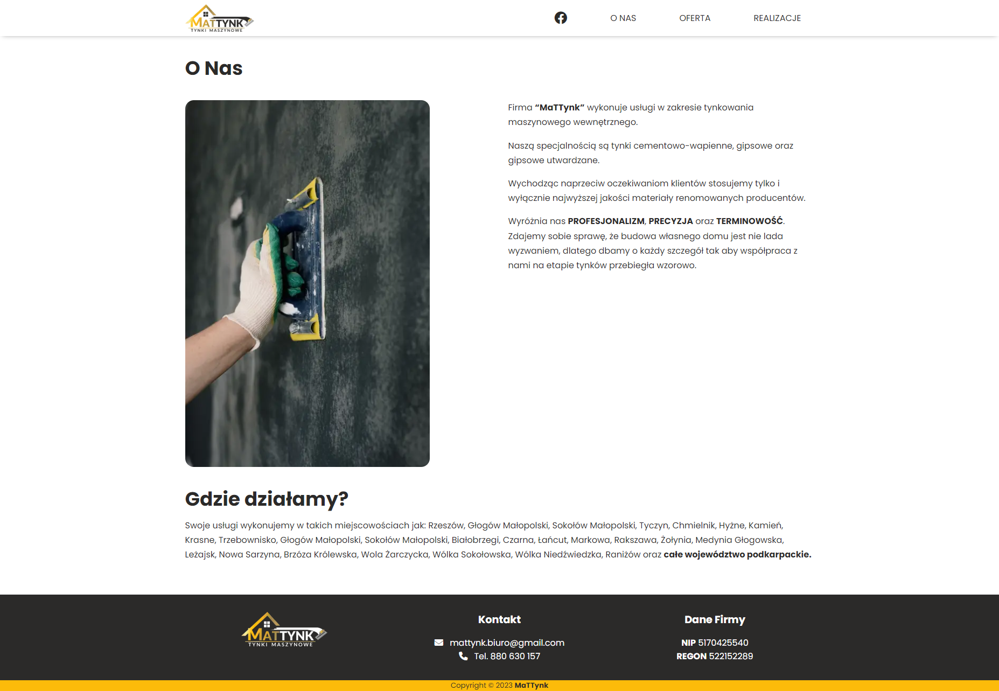
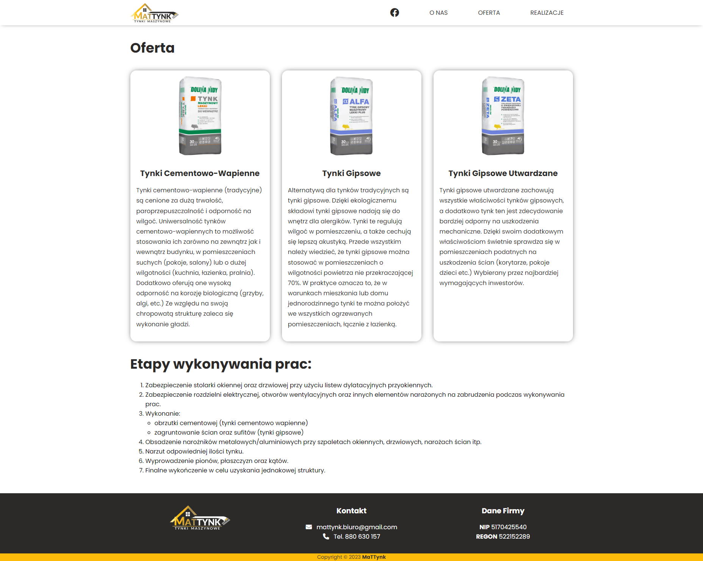
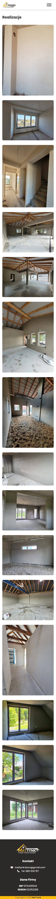

# MaTTynk - Tynki Maszynowe

## Introduction

The MaTTynk website is designed to showcase and promote a machine plastering company called "MaTTynk". The primary goal of this webpage is to provide valuable information about the company's expertise and experience in the field of machine plastering.

## Table of Contents

- [Links](#Links)
- [Built with](#built-with)
- [Website Tabs](#tabs)

### Links

- URL to Website: (https://tynkimaszynowerzeszow.pl/)

### Built with

- HTML
- CSS
- Javascript

### Tabs

The MaTTynk website consists of the following tabs:

- Starting Page: Introduction to the company and its services.
- About Us: Provides an overview of MaTTynk's background and informations about area in which the services are offered.
- Offer: Showcases the range of services and solutions offered by MaTTynk.
- Projects: Displays a portfolio of past plastering projects completed by MaTTynk.

### Starting Page

_Description: This is how the Starting Page appears on desktop._

_Description: This is how the Starting Page appears on mobile._

### About Us

_Description: This is how the About Us page appears on desktop._

_Description: This is how the About Us page appears on mobile._

### Offer

_Description: This is how the Offer page appears on desktop._

_Description: This is how the Offer page appears on mobile._

### Projects

_Description: This is how the Projects page appears on desktop._

_Description: This is how the Projects page appears on mobile._
